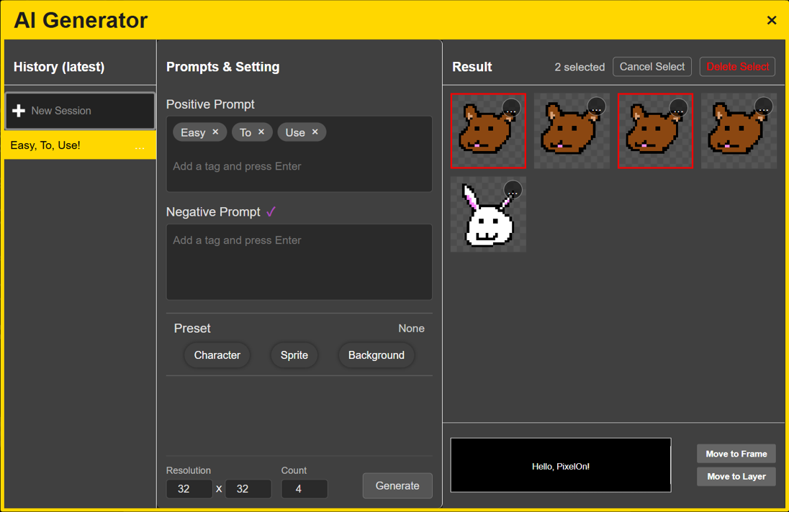
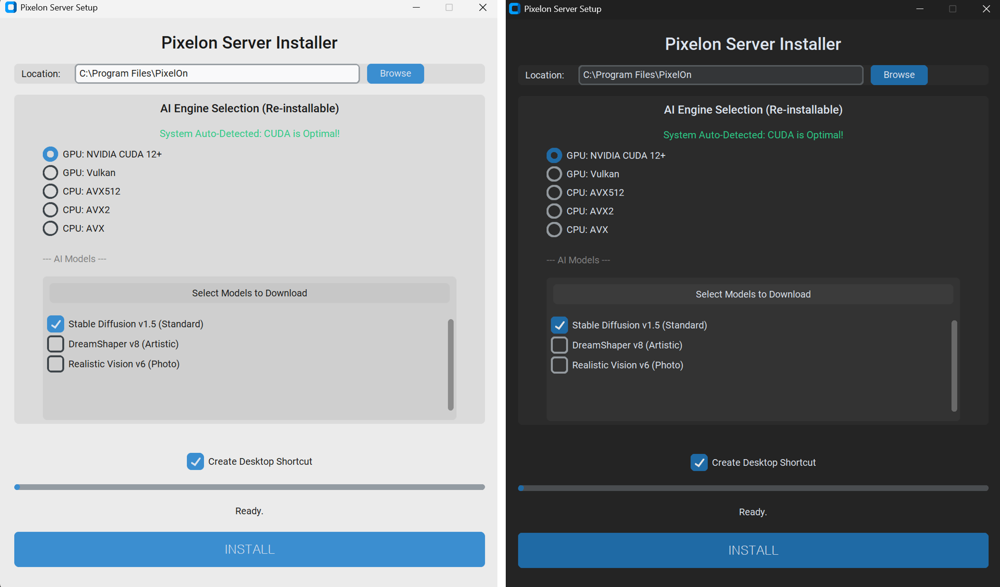
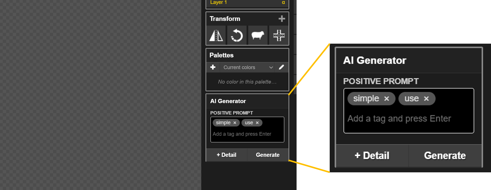
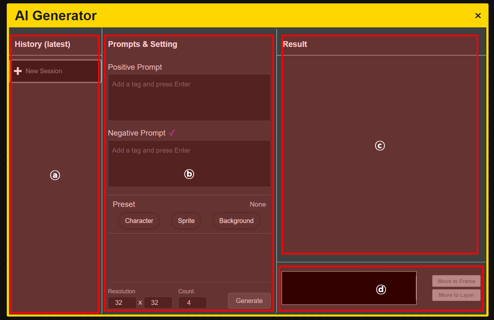
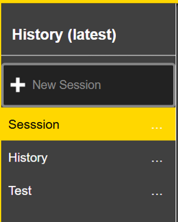
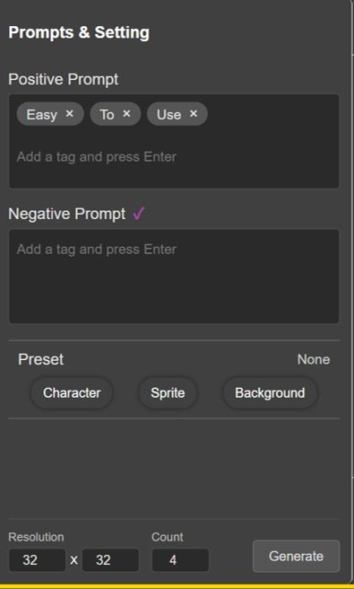
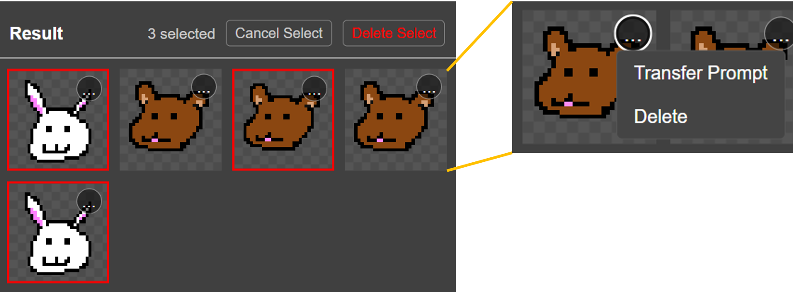
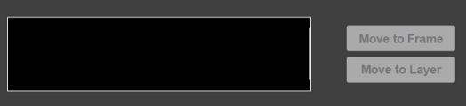
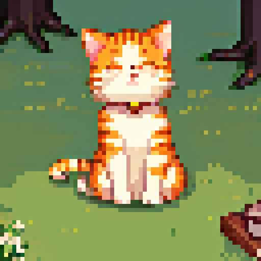
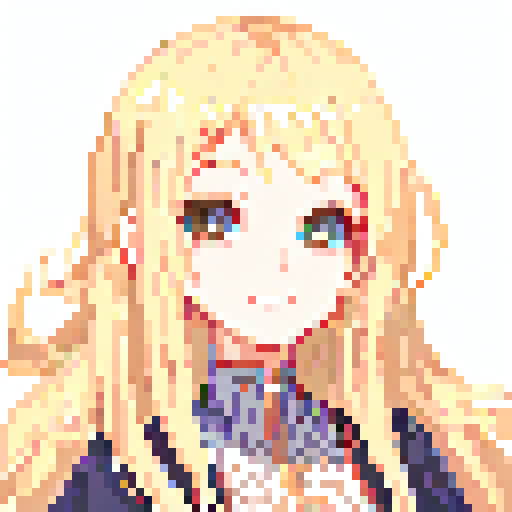

# PixelOn

## What is PixelOn?

**PixelOn** is an extension that adds **On-Device** image generation capabilities to **Piskel**, the PixelArt Editor.
This allows users to create pixel art using AI image generation easily and quickly, anywhere and anytime.

Boost your expressiveness!

We used Stable Diffusion C++ to implement lightweight and fast image generation (**4-5 seconds on NVIDIA RTX 3070**). Combined with Piskel, it provides a seamless creative experience.

This project was designed and developed to allow anyone to use Generative AI on their own computer as GPU adoption in households increases, moving away from cloud-based generators that require continuous subscription fees.

### Key Features
* **AI Image Generation:** Generate pixel art via text prompts
* **Compatibility:** Fully compatible with existing `.piskel` files
* **Export:** Immediately export generated images to Editor layers

### System Requirements (Minimum & Recommended)
| Type | Minimum | Recommended |
| :--- | :--- | :--- |
| **CPU** | Intel i5 or higher | Intel i5 or higher |
| **RAM** | 16GB or higher | 16GB or higher |
| **GPU** | NVIDIA RTX 2000 Series (4GB VRAM+) | NVIDIA RTX 3070 or higher |
| **Disk** | 20GB+ Free Space | 20GB+ Free Space |

> **Notice 1:** CPU-only usage is possible, but it may take 2-3 minutes or more per image. (Approx. 10s on RTX 2060)
> **Notice 2:** AMD GPU support will be updated in the future.

### Open Source Credits
* [Stable Diffusion C++](https://github.com/leejet/stable-diffusion.cpp)
* [Piskel](https://www.piskelapp.com/)
    * [PixelOn Piskel Repository](https://github.com/PixelOn-Project/piskel)
* **Stable Diffusion 1.5 Models & LoRAs**
    * For information about the AI models and LoRAs used, please refer to the [AI Models Used](#3-ai-models-used) section below.

---

## How to install Piskel & PixelOn?

1. Click **[Download PixelOn Installer](https://github.com/PixelOn-Project/pixelon-server/releases/latest/)** to get the installation file.
2. Run the installer to automatically scan your system and select the optimal acceleration version (CUDA, etc.).
3. Once installation is complete, run **PixelOn** from your desktop.

### Q & A
* **Q. I have an Nvidia GPU but CUDA is not selected.**
    * A. Your GPU driver might be outdated. Please update to the latest version at **[Nvidia Driver Download](https://www.nvidia.com/Download/index.aspx)**.
* **Q. I have an AMD GPU, but ROCm is not selected or errors occur during execution.**
    * A. Your GPU driver might be outdated. Please update to the latest version at **[AMD Drivers Support](hhttps://www.amd.com/en/support/download/drivers.html)**.
* **Q. It says "Server Connection Failed".**
    * A. There may be missing files due to network issues during installation. Please reinstall via the installer.
* **Q. Generation speed is too slow.**
    * A. Speed can be slow if you don't have a GPU accelerator or meet the specs. This is a physical limitation of local execution.
* **Q. How do I uninstall PixelOn?**
    * A. You can uninstall it by running PixelOn Installer.exe again, or by searching for PixelOn in Windows `Settings > Apps > Installed apps`.
---

## How to Use PixelOn?

### 1. Piskel Editor
When you run PixelOn, the Piskel editor screen appears. You can perform dot work just like existing Piskel usage. For detailed usage, please refer to the **[Piskel Official Guide](https://www.piskelapp.com/wiki/help)**.

### 2. Simple Prompt

You can quickly generate images using the prompt window at the bottom of the editor. Only **Positive Prompts** can be entered in this window.

### 3. Detail Dialog

Open the Detail window for more precise work. Detailed descriptions of each component are below.

 

<table>
<tr>
<td width="50%" valign="top">
    
</td>
<td width="50%" valign="top">
    <h3>ⓐ History Management</h3>
    
Manage previous work sessions in the <b>History</b> tab.

    <ul>
        <li><b>Click Session:</b> View past generation records.</li>
        <li><b>... Button:</b> Rename or delete the session.</li>
        <li><b>Warning:</b> Deletion cannot be undone (Undo), so please decide carefully.</li>
    </ul>
</td>
</tr>
</table>

 

<table>
<tr>
<td width="50%" valign="top">
    
</td>
<td width="50%" valign="top">
    <h3>ⓑ Prompt & Settings</h3>
    
Manipulate key settings for image generation.

    <ul>
        <li><b>Positive Prompt:</b> Scene description (Tag format, separated by Enter)</li>
        <li><b>Negative Prompt:</b> Elements to exclude (e.g., low quality)</li>
        <li><b>Preset:</b> Select model preset (Normal, Pixel Art, etc.)</li>
        <li><b>Resolution / Count:</b> Adjust image size and count</li>
    </ul>
    <blockquote><b>Note:</b> If the resolution is too small, the image may not generate correctly.</blockquote>
</td>
</tr>
</table>

 

<table>
<tr>
<td width="50%" valign="top">
    
</td>
<td width="50%" valign="top">
    <h3>ⓒ Results</h3>
    
Check and manage generated images.

    <ul>
        <li><b>Left Click:</b> Select image</li>
        <li><b>... Click (Top of Image):</b>
            <ul>
                <li><i>Transfer:</i> Load settings from generation time</li>
                <li><i>Delete:</i> Delete the image</li>
            </ul>
        </li>
        <li><b>Cancel:</b> Deselect image</li>
        <li><b>Delete Selected:</b> Delete selected images in bulk</li>
    </ul>
    <blockquote><b>Warning:</b> Deletion cannot be undone.</blockquote>
</td>
</tr>
</table>

 

<table>
<tr>
<td width="50%" valign="top">
    
</td>
<td width="50%" valign="top">
    <h3>ⓓ Log, Expert</h3>
    
Check logs or send images to Editor.

    <ul>
        <li><b>Move To Frame:</b> Exports selected images as <b>New Frames</b> respectively. (Useful for multi-image work)</li>
        <li><b>Move To Layer:</b> Exports the last selected image to the <b>Current Layer</b>. (Useful for single image work)</li>
    </ul>
</td>
</tr>
</table>

 

---

## Usage Tips

### 1. Prompt Tag Input
PixelOn uses multiple **tags** to compose prompts. After entering text, press the **Enter key** to register a tag. The entered tags are internally connected and used for image generation.

    

### 2. Effective Prompt Writing

#### Prompt Writing Tips

* **Don't make it too complex**: Each tag should be written as a noun or adjective + noun, preferably within 3-4 words.
* **Set appropriate resolution:** Resolutions smaller than 64x64 make it difficult to express details.
  * For General, Character, SD Character models, 64x64 is recommended.
  * For Background models, 128x128 is recommended.
* **Try multiple times:** AI generation is probabilistic, so the same prompt can produce different results each time.
* **Tag order matters:** Tags positioned earlier have a greater influence on image generation.
* **Use Negative Prompts:** Specifying unwanted elements (e.g., garish, amateur) improves quality.

#### Prompt Examples

<table>
<tr>
<td width="50%" align="center">
    
    

    Preset: General 
    Resolution: 64x64 
    Positive Prompt: <code>cat</code> <code>fluffy fur</code> <code>sitting on grass</code> 
    Negative Prompt: - 
    

</td>
<td width="50%" align="center">
    
    

    Preset: Character 
    Resolution: 64x64 
    Positive Prompt: <code>girl</code> <code>long hair</code> <code>blonde hair</code> <code>pretty face</code> <code>smiling</code> 
    Negative Prompt: - 
    

</td>
</tr>
<tr>
<td width="50%" align="center">
    
    

    Preset: SD Character 
    Resolution: 64x64 
    Positive Prompt: <code>girl</code> <code>twin tails</code> <code>red and white dress</code> <code>cute pose</code> 
    Negative Prompt: - 
    

</td>
<td width="50%" align="center">
    
    

    Preset: Background 
    Resolution: 128x128 
    Positive Prompt: <code>mountain landscape</code> <code>snow peaks</code> <code>clear sky</code> <code>pine trees</code> <code>sunrise</code> 
    Negative Prompt: - 
    

</td>
</tr>
</table>

### 3. AI Models Used

PixelOn utilizes the following open-source AI models:

* **Base Model (Stable Diffusion 1.5):** [Cetus-Mix](https://civitai.com/models/6755?modelVersionId=48569), [QteaMix](https://civitai.com/models/50696/qteamix-q?modelVersionId=94654)
* **LoRA:** [8bitdiffuser 64x](https://civitai.com/models/185743/8bitdiffuser-64x-or-a-perfect-pixel-art-model), [pixel world](https://civitai.com/models/115889/pixel-world), [pixelartredmond-1-5v-pixel-art-loras-for-sd-1-5](https://huggingface.co/artificialguybr/pixelartredmond-1-5v-pixel-art-loras-for-sd-1-5)

> Each model follows its respective license. Please check each model's license for commercial use.

Each preset uses the following model combinations:

* **General**: Cetus-Mix base + pixelartredmond-1-5v-pixel-art-loras-for-sd-1-5 LoRA
* **Character**: Cetus-Mix base + 8bitdiffuser 64x LoRA
* **SD Character**: QteaMix base + 8bitdiffuser 64x LoRA
* **Background**: Cetus-Mix base + pixel world LoRA

---

## Development Environment

### Prerequisites
* Windows OS
* [Python](https://www.python.org/downloads/) >= 3.10
* [Node.js](https://nodejs.org/ko/download)
*(We build on Python 3.14 and Node 24.11.1)*

### How to setup
1. Prepare an environment that meets the above prerequisites.
2. Run `bootstrap.bat` to install necessary dependencies.
    * Includes: Stable Diffusion C++, Piskel (Forked Repo), AI Models
3. Run `python app.py` to start the local server.

### Contribute
Please use the `dev` branch if you want to contribute. Pull Requests are always welcome!

## License
This project follows the [MIT License](LICENSE).